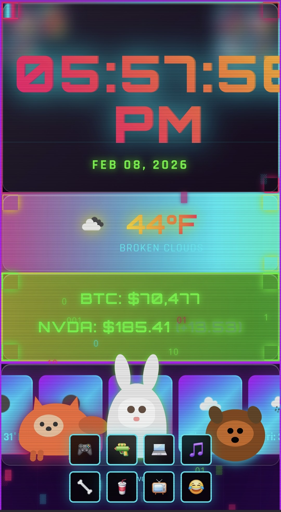

# Ultimate Smart Alarm Clock 🌦️⏰

A feature-packed smart alarm clock for 480x800 touchscreens with weather radar, Bitcoin/stocks, games, animal companions, and more!



## 🎯 Features

### Core Features
- **Live Clock** - Real-time clock with 12/24-hour format toggle
- **Weather Display** - Current conditions, 5-day forecast, and radar
- **Bitcoin & Stock Tracker** - Live prices from CoinGecko & AlphaVantage
- **Weather Alerts** - Emergency alert system with audio warnings
- **News Ticker** - Scrolling headlines from Google News

### Weather Effects
- **Visual Effects** - Rain, snow, wind, and lightning animations
- **Weather Radar** - Live radar map using RainViewer API
- **Night Mode** - Auto-dimming (10pm-6am) or manual override

### Fun Extras
- **Animal Companions** - Fox 🦊 and Dog 🐕 that roam your screen
- **Carrot Rain** - Easter egg: Make it rain carrots! 🥕
- **Matrix Effect** - Falling green code animation 💻
- **Tetris Game** - Classic game built-in 🎮
- **Wolfenstein 3D** - Playable retro FPS 🔫
- **Spotify Player** - Embedded Juice WRLD playlist 🎵
- **Debug Panel** - Monitor all system states 🐞

## 🚀 Quick Start

### Deploy to GitHub Pages

1. **Create Repository**
   ```bash
   # Create new repo on GitHub named 'smart-alarm-clock'
   ```

2. **Upload File**
   - Upload `index.html` to your repository
   - No other files needed!

3. **Enable Pages**
   - Go to Settings → Pages
   - Source: `main` branch
   - Save

4. **Access**
   - Visit: `https://YOUR-USERNAME.github.io/smart-alarm-clock/`

### Local Testing

Simply open `index.html` in any modern browser!

## ⚙️ Configuration

Click the ⚙️ Settings button to configure:

- **ZIP Code** - Your location for weather data
- **Stock Symbol** - Any stock ticker (default: NVDA)
- **Time Format** - 12 or 24-hour display
- **AlphaVantage API Key** - Optional (comes with fallback to Yahoo Finance)

Settings are saved in browser localStorage.

## 🎮 Controls Guide

### Top Left Controls
- ⚙️ **Settings** - Configure ZIP, stocks, time format
- ☀️🌙 **Night Mode** - Toggle day/night brightness
- 🐞 **Debug** - Show system status panel

### Top Right Controls
- 🛰️ **Radar** - Toggle weather radar map
- 📺 **Stocks** - Show/hide financial data
- 📰 **News** - Scrolling news ticker
- 🥕 **Carrot Rain** - Make it rain carrots!

### Bottom Controls
- 🎮 **Tetris** - Play Tetris
- 🔫 **Wolf3D** - Play Wolfenstein 3D
- 🦴 **Dog Treat** - Make dog happy
- 🥤 **Mountain Dew** - Energize the fox
- 💻 **Matrix** - Matrix falling code effect
- 🎵 **Music** - Spotify player
- 😂 **Ahahah** - Surprise!

## 🔧 Customization

### Change Default Location

Edit line 278 in `index.html`:
```javascript
DEFAULT_ZIP: '63090', // Change to your ZIP code
```

### Change Default Stock

Edit line 279:
```javascript
DEFAULT_STOCK: 'NVDA', // Change to your preferred stock
```

### Get Your Own API Keys (Free!)

**OpenWeather API** (weather data):
1. Sign up at https://openweathermap.org/api
2. Get free API key (60 calls/min)
3. Replace on line 277

**AlphaVantage API** (stocks):
1. Sign up at https://www.alphavantage.co/support/#api-key
2. Get free API key (5 calls/min)
3. Enter in Settings modal

**Note**: The app comes with working demo keys and Yahoo Finance fallback!

## 🎨 Weather Effects

The app automatically shows visual effects based on current weather:

- **Rain/Drizzle** → Falling raindrops
- **Snow** → Snowflakes
- **Thunderstorm** → Lightning flashes
- **Wind** → Blowing wind effect
- **Clouds** → Cloud overlay

## 📡 APIs Used

All free, no authentication required (except optional upgrades):

- **Weather**: OpenWeatherMap API
- **Radar**: RainViewer API
- **Bitcoin**: CoinGecko API
- **Stocks**: AlphaVantage + Yahoo Finance (fallback)
- **Alerts**: National Weather Service API
- **News**: Google News RSS
- **Maps**: OpenStreetMap + Leaflet

## 🎯 Use Cases

### Raspberry Pi Touchscreen

Perfect for 480x800 displays! Set up in kiosk mode:

```bash
chromium-browser --kiosk --incognito https://YOUR-USERNAME.github.io/smart-alarm-clock/
```

Auto-start on boot:
```bash
# Add to ~/.config/lxsession/LXDE-pi/autostart
@chromium-browser --kiosk --incognito https://YOUR-USERNAME.github.io/smart-alarm-clock/
```

### Smart Mirror Display
### Bedside Tablet
### Kitchen Display
### Office Dashboard

## 🐛 Troubleshooting

**Weather not loading?**
- Check your ZIP code is valid US ZIP
- Try refreshing the page
- Check browser console for errors

**Stock prices show "Unavailable"?**
- AlphaVantage has rate limits (5/min free tier)
- App will fallback to Yahoo Finance
- Wait 1 minute and try again

**Radar not showing?**
- Click the 🛰️ button to toggle
- Map loads on first toggle
- Requires internet connection

**Games not loading?**
- Click button again
- Check internet connection
- Some games use external embeds

## 🎮 Easter Eggs

Try these:
1. Click the carrot rain button 🥕
2. Give the dog a treat 🦴
3. Give the fox Mountain Dew 🥤
4. Watch the fox dash randomly
5. Try the ahahah button 😂
6. Enable Matrix mode 💻

## 📱 Browser Compatibility

✅ Chrome/Chromium  
✅ Firefox  
✅ Safari  
✅ Edge  
✅ Mobile browsers  

Optimized for 480x800 but works on any size!

## 📊 Technical Details

- **Framework**: Vanilla JS with jQuery
- **File Size**: Single HTML file (~30KB)
- **Dependencies**: jQuery, Moment.js, Leaflet (CDN)
- **Storage**: localStorage for settings
- **Refresh Rate**: 
  - Clock: 1 second
  - Weather: 10 minutes
  - Stock: 1 minute
  - Bitcoin: 1 minute
  - Alerts: 15 minutes

## 🎨 Design Features

- Gradient backgrounds
- Smooth transitions
- Responsive buttons
- Animated weather effects
- Dynamic night mode
- Debug panel for monitoring

## 🔐 Privacy

- All data stored locally in browser
- No user tracking
- No data sent to third parties
- API calls only for public data
- Can run fully offline (with cached data)

## 📝 License

MIT License - Use freely!

## 🙏 Credits

- Weather data: OpenWeatherMap
- Radar: RainViewer
- Stock data: AlphaVantage & Yahoo Finance
- Bitcoin: CoinGecko
- Alerts: National Weather Service
- News: Google News RSS
- Maps: OpenStreetMap & Leaflet
- Icons: Native emoji

## 🚀 Future Ideas

- [ ] Multiple location support
- [ ] Custom color themes
- [ ] Alarm clock functionality
- [ ] Calendar integration
- [ ] Smart home controls
- [ ] Voice commands
- [ ] More games!

## 💡 Contributing

Found a bug? Have an idea? 
- Open an issue on GitHub
- Submit a pull request
- Share your customizations!

---

Made with ❤️ for the smart display community

**Enjoy your ultimate smart alarm clock!** ⏰🎮🦊
